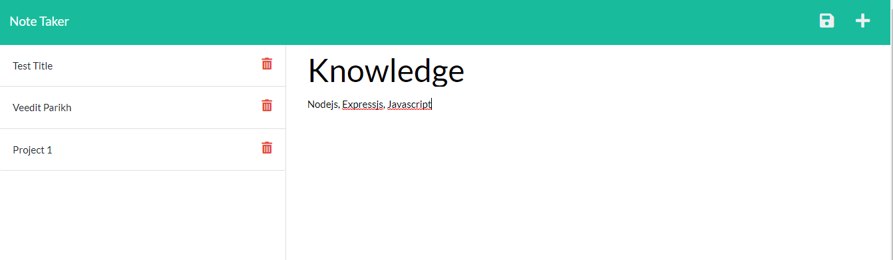
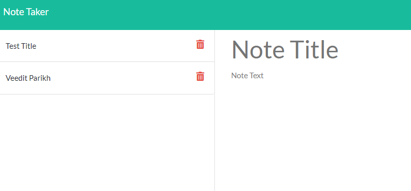

# Note-Taker

Note taker is an app to add, post, delete notes being created.
## Purpose

Note Taker is mainly used to add new note by using the get route, post notes by the use of post route and delete the notes created by using the delete route.
## Built With

Node
Express js
## Website

## Application

## Contribution

Made by Veedit Parikh